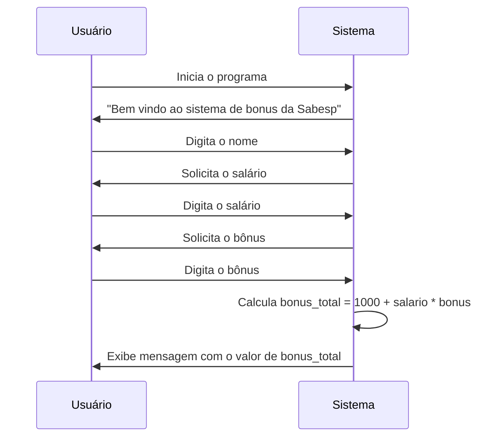
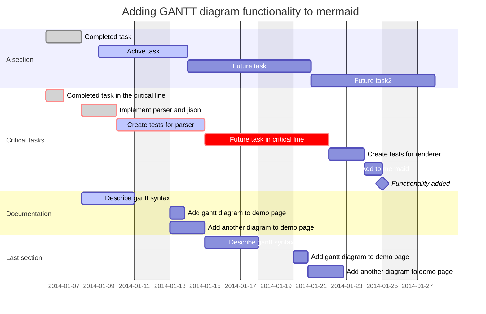

# Titulo

## Subtitulo

### Subsubtitulo

O programa deve *começar* solicitando ao usuário que **insira seu nome**.

O usuário deve:
1. Inserir seu nome
2. Inserir seu salário
3. Inserir seu bonos

[Site da Sabesp](https://www.sabesp.com.br/)


```python
    print("Bem vindo ao sistema de bonus da Sabesp")
    nome = input("Por favor digite o seu none: ")
    salario = float(input("Por favor digite o seu salário: "))
    bonus = float(input("Por favor digite o seu bônus: "))
    bonus_total = 1000 + salario * bonus
    print(f"Olá {nome}, o seu valor foi de {bonus_total}")
```





| Tables        | Are           | Cool  |
| ------------- |:-------------:| -----:|
| col 3 is      | right-aligned | $1600 |
| col 2 is      | centered      |   $12 |
| zebra stripes | are neat      |    $1 |

Em seguida, o programa deve pedir ao usuário para inserir o valor do seu salário. Considere que este valor pode ser um número decimal.
Depois, o programa deve solicitar a porcentagem do bônus recebido pelo usuário, que também pode ser um número decimal.
O cálculo do KPI do bônus de 2024 é de 1000 + salario * bônus
Finalmente, o programa deve imprimir uma mensagem no seguinte formato: "Olá [nome], o seu valor bônus foi de 5000".
